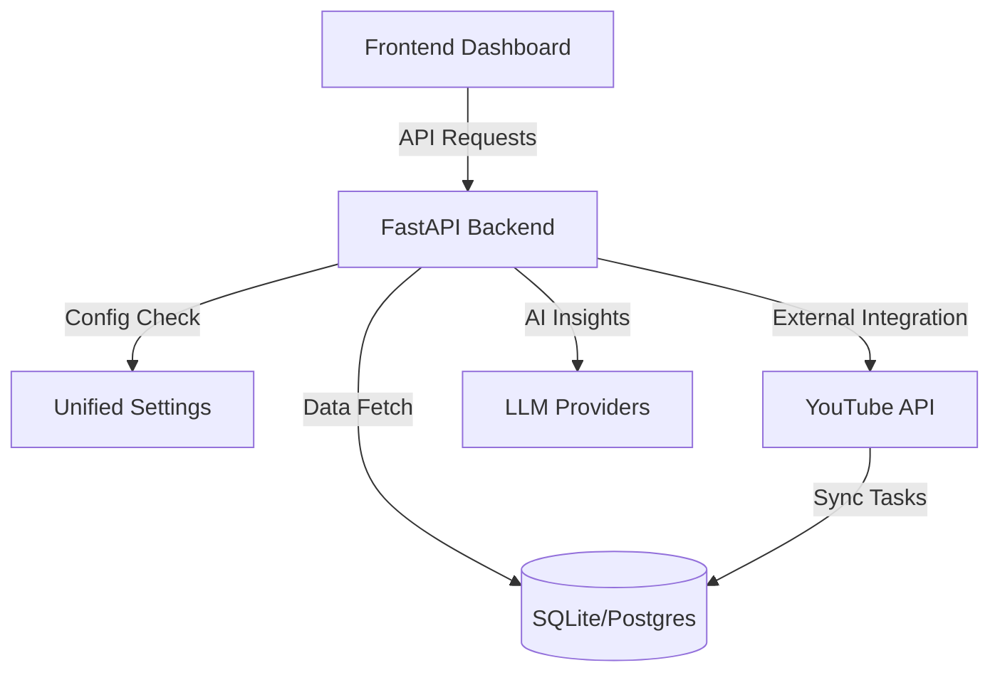

# System Architecture - v3.0

## High-Level Vision

YouTube AI Platform v3.0 is designed as a modular, scalable "Command Center" for digital creators. The architecture prioritizes data decoupling, AI provider flexibility, and production-ready security patterns.

## Technical Stack

- **Languages**: Python 3.10+, TypeScript 5.0+
- **Core Frameworks**: FastAPI (Backend), React 18 (Frontend)
- **Data Persistence**: SQLAlchemy Core with Async Support
- **UI System**: Material UI (MUI) with Custom Branding
- **State Management**: React Hooks & Context API

## Component Breakdown

### 1. Unified Configuration Suite

We have moved away from disparate environment checks to a centralized configuration pattern.

- **EnhancedSettings**: A Pydantic BaseSettings class that organizes parameters into logical blocks (AI, Database, Security, YouTube).
- **Core Proxy**: `backend/core/config.py` acts as a proxy to maintain compatibility with legacy modules while pulling from the unified source of truth.

### 2. AI Content Engine

The content engine is designed to be provider-agnostic.

- **Service Layer**: Abstracts the complexity of different LLM prompts.
- **Generation Workflow**: Handles script writing, title optimization, and thumbnail concept generation in a multi-stage pipeline.

### 3. YouTube/Google Integration

- **OAuth 2.0 Flow**: Securely handles user authentication and token management.
- **Data Sync**: Background synchronization tasks ensure the dashboard always displays real-time performance metrics without blocking the UI.

### 4. Revenue & Analytics

- **Historical Tracking**: Stores granular data points for views and earnings.
- **Predictive Modeling**: Simple AI forecasting based on historical growth rates and content niche performance.

## Data Flow Diagram

## Security Implementation

- **JWT Authentication**: Industry-standard stateless session management.
- **Password Bracing**: Argon2/bcrypt password hashing.
- **Secret Key Rotation**: Fail-safe mechanisms for environmental variable loading.

---
**Senior Architect Note**: The v3.0 architecture provides the foundation for Phase 4 expansion, including multi-channel support and deep-learning video synthesis.
