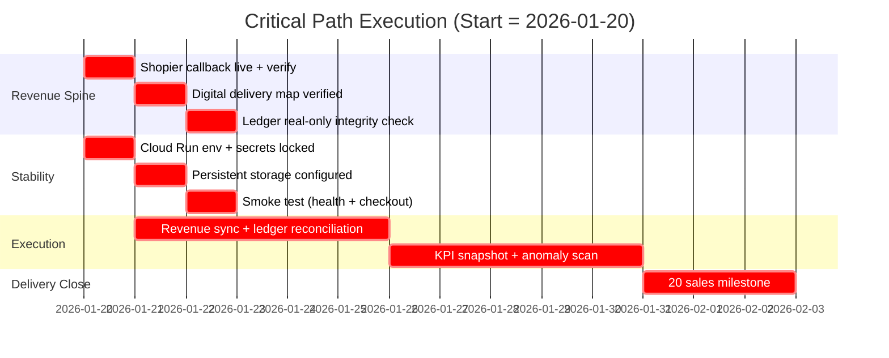

# Execution Jobload (Critical Path)

This maps the critical-path delivery sequence to online schedules.



## Online Jobload (Cloud Scheduler)
Configured via HTTP calls to the ops endpoints (preferred for Cloud Scheduler):

- `POST /api/ops/run/revenue-sync`
- `POST /api/ops/run/ledger-monitor`
- `POST /api/ops/run/growth-snapshot`
- `POST /api/ops/run/health-report`
- `POST /api/ops/run/shopier-verify`
- `POST /api/ops/run/alexandria-genesis`
- `POST /api/ops/run/global-revenue-sync`
- `POST /api/ops/run/payout-orchestrator`

Use `scripts/cloud_scheduler_http_jobload.sh` to create the schedules.
Optional flags:
- `ENABLE_GLOBAL_SYNC=true` to schedule `global-revenue-sync`.
- `ENABLE_PAYOUT_JOB=true` to schedule `payout-orchestrator`.
- `ENABLE_HOURLY_BATCH=true` with `HOURLY_TASKS=task1,task2` to schedule the batch endpoint.

Example:
`ENABLE_HOURLY_BATCH=true HOURLY_TASKS=revenue-sync,ledger-monitor bash scripts/cloud_scheduler_http_jobload.sh`

## Batch Trigger (Optional)
You can call a single batch endpoint to fan-out tasks:

`POST /api/ops/run`

Example body:
```json
{
  "tasks": ["revenue-sync", "ledger-monitor", "growth-snapshot"],
  "background": true
}
```
