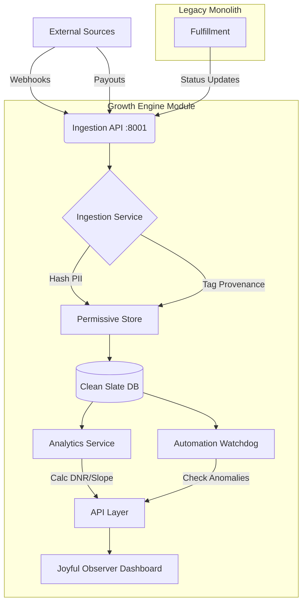

# Architecture: Autonomous Growth Engine V1 (Clean Slate)

## Overview

The **Growth Engine V1** is a self-contained, high-performance module designed to autonomously track specific revenue outcomes (North Star Metric: Daily Net Revenue) without coupling to the legacy monolith. It adheres to the "Clean Slate" principle: new models, new ingestion patterns, and parallel execution.

## System Topology

## Key Components

### 1. Ingestion Layer (`ingest.py`, `webhook_adapter.py`)

- **Principle:** Permissive Intake. Never block; ingest first, validation later (if needed).
- **Adapters:**
  - `Shopier`: Maps payment webhooks to `GrowthOrder`.
  - `Shopify`: Maps order webhooks.
  - `Generic`: Flexible JSON intake.

### 2. Data Model (`models.py`)

- **Isolation:** Uses `growth_engine.db` (SQLite) for V1.
- **core Models:**
  - `GrowthOrder`: Raw intake.
  - `GrowthLedgerEntry`: The financial truth (CLEARED vs PENDING).
  - `GrowthSku`: Catalog data.
- **Privacy:** `customer_hash` (SHA-256) replaces raw email storage by default.

### 3. Analytics & Automation (`analytics.py`, `automation.py`)

- **North Star:** Daily Net Revenue (DNR).
- **Slope:** 7-day trend calculation.
- **Watchdog:**
  - `REVENUE_DIP`: Alerts if DNR drops >20% YoY (Yesterday-over-Yesterday).
  - `NO_SIGNAL`: Alerts on 0 events/24h.

### 4. User Interface (`static/dashboard.html`)

- **Tech:** Vanilla JS + Vega-Lite.
- **Design:** "Joyful Observer" (Warm accents, clean typography).
- **Feeds:** Real-time polling of `/dashboard/kpi`, `/dashboard/series`, and `/dashboard/alerts`.

## Scaling Strategy (Phase 4+)

1. **Database:** Migrate `growth_engine.db` to Postgres Schema `growth_v1`.
2. **Queue:** Move Ingestion from sync writes to Redis Queue (`celery`).
3. **Monolith:** Mount `modules.growth_engine_v1.app` into the main `FastAPI` app as a sub-application for single-port deployment (optional).
